# Cadmin

Cadmin 是一个前后端分离的后台开发项目集合,各项目基于前后端接口交互文档进行开发, 便于开发者选择自己熟悉的技术栈进行开发.

在线文档地址:<https://baiy.github.io/Cadmin/>

## 功能

为适应更多的业务场景, 系统尽可能只集成最基础的后台功能, 以减少对业务的干扰. 大致功能如下:

1. 用户/用户组: 后台用户基础信息维护和登录状态保持
2. 权限/请求/菜单: 对前端API请求权限校验和菜单进行配置
3. 请求调度: 请求前端API请求进行调度, 分配给对应的业务模块处理

## 相关链接

| - | 项目地址 | 文档地址 |
| --- | --- | --- |
| 前后端交互接口协议 | - | [访问](api/README) |
| 数据库 | - | [访问](server/db) |
| 服务端 | - | - |
| &nbsp;&nbsp;&nbsp;-PHP   | [[github](https://github.com/baiy/Cadmin-server-php)] [[gitee](https://gitee.com/baiy/Cadmin-server-php)] | [访问](server/php) |
| &nbsp;&nbsp;&nbsp;-Golang   | [[github](https://github.com/baiy/Cadmin-server-go)]  [[gitee](https://gitee.com/baiy/Cadmin-server-go)] | [访问](server/go) |
| 客户端 | - | - |
| &nbsp;&nbsp;&nbsp;-Vue   | [[github](https://github.com/baiy/Cadmin-client-vue)] [[gitee](https://gitee.com/baiy/Cadmin-client-vue)] | [访问](client/vue) |
| &nbsp;&nbsp;&nbsp;-React   | [[github](https://github.com/baiy/Cadmin-client-react)] [[gitee](https://gitee.com/baiy/Cadmin-client-react)] | [访问](client/vue) |

## 演示
* vue版前端: <https://baiy.gitee.io/cadmin-client-vue/>
* react版前端: <https://baiy.gitee.io/cadmin-client-react/>

> 1. 演示站点服务端使用Golang版
> 2. 后端数据库每小时重置数据库

## 效果图

|页面| vue | react |
| --- | --- | --- |
| 登录 | 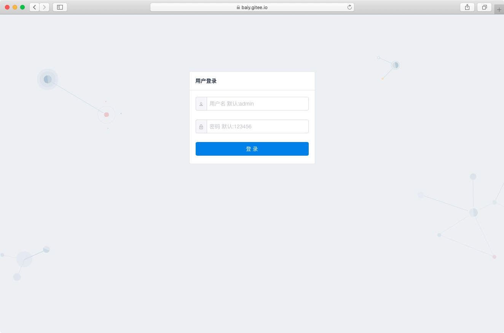 | |
| 用户管理 |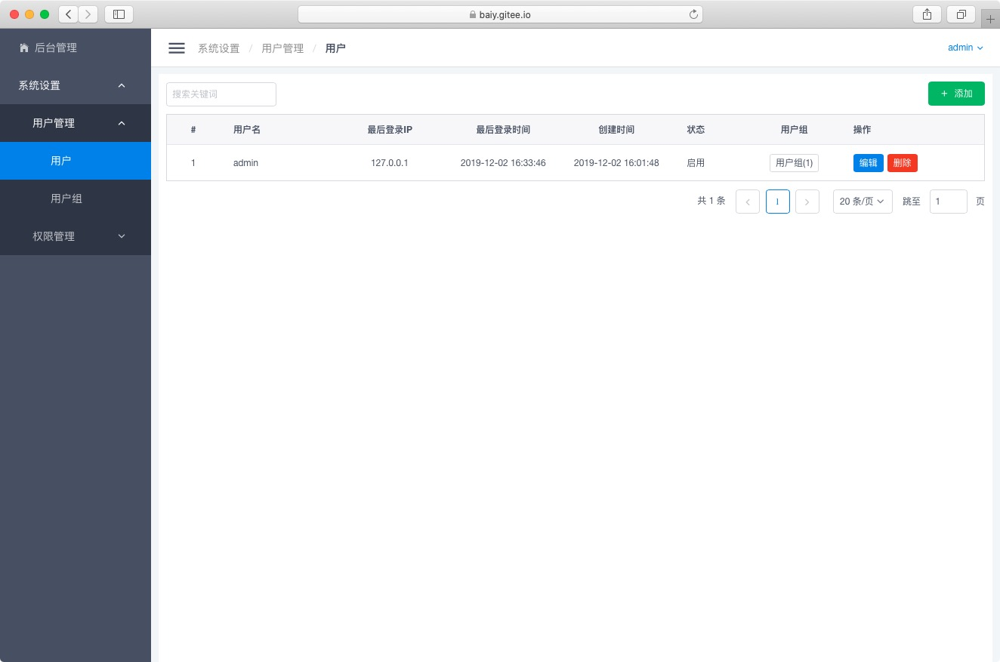 |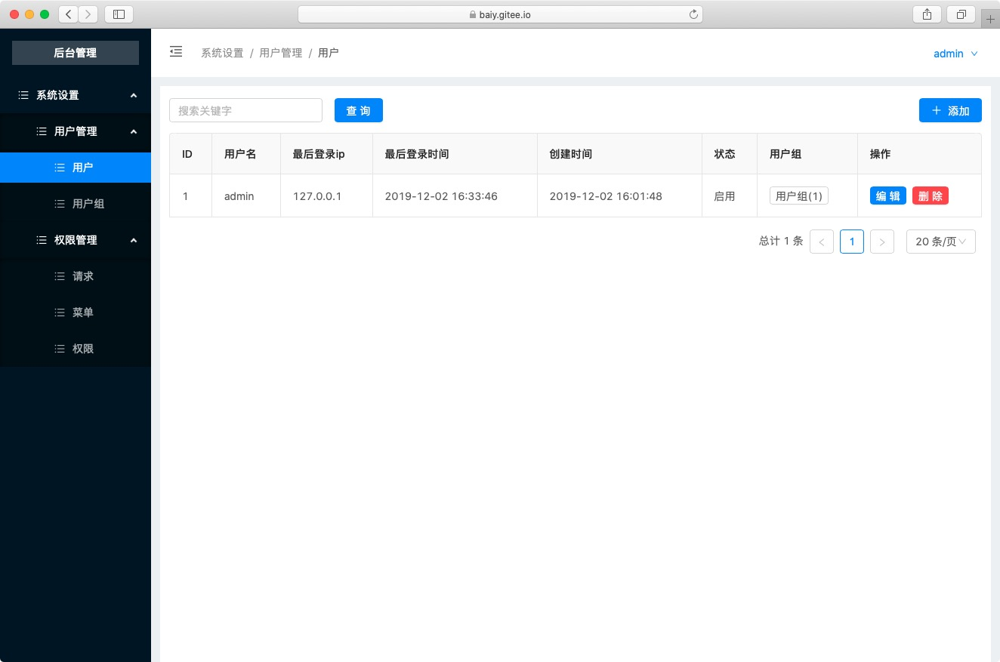 |
| 请求管理 |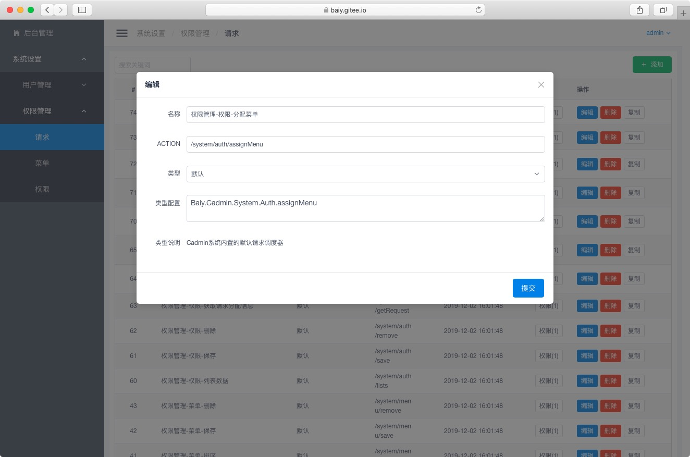 |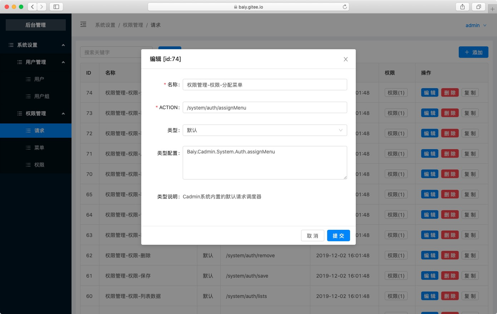 |
| 菜单管理 |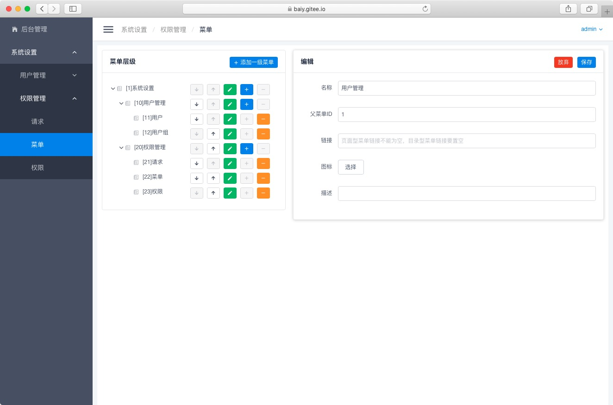 |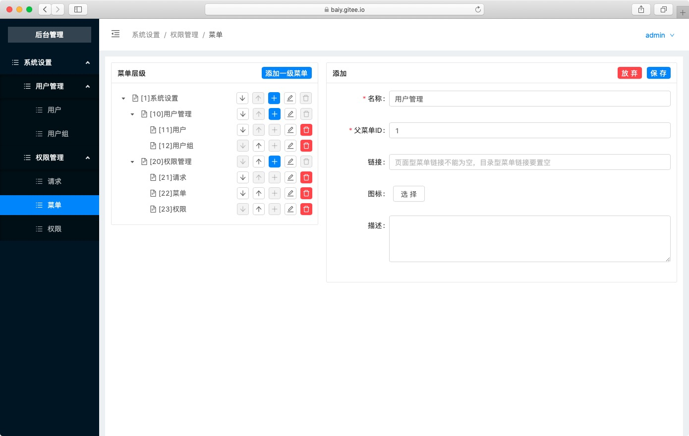 |
| 权限管理 |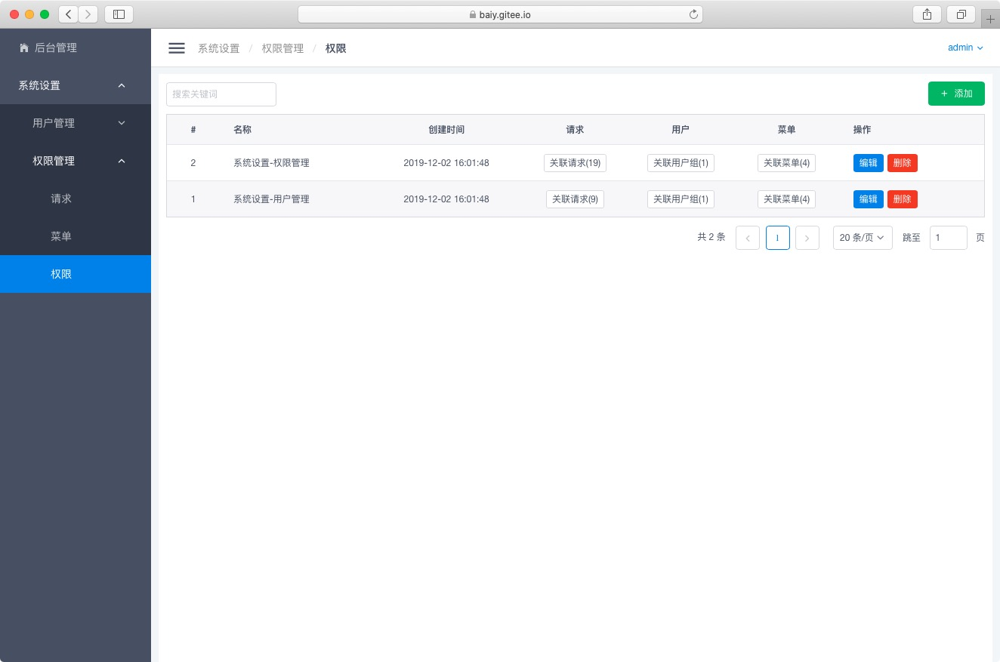 |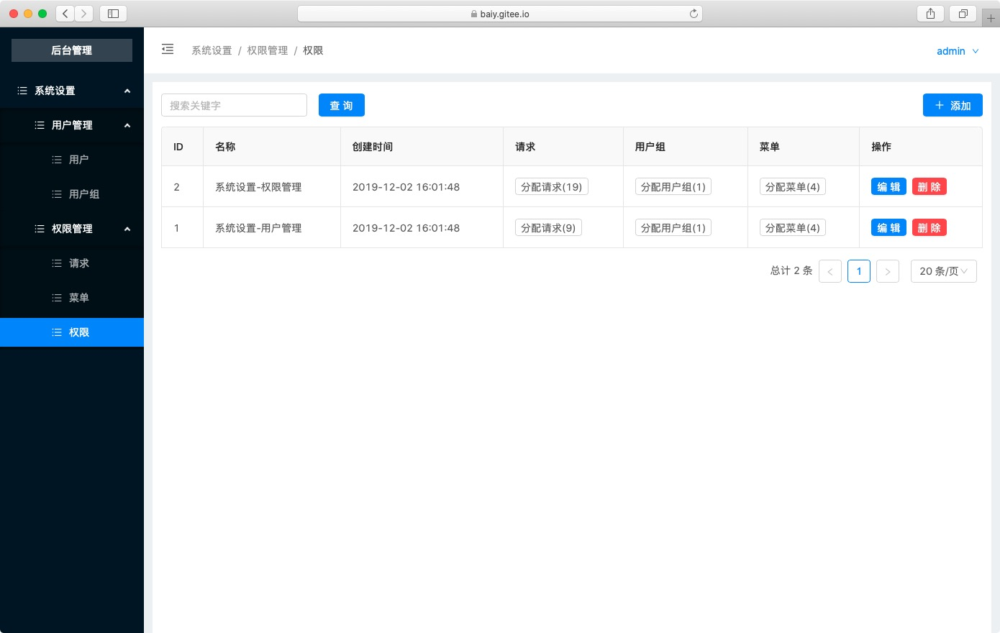 |
| 权限分配 |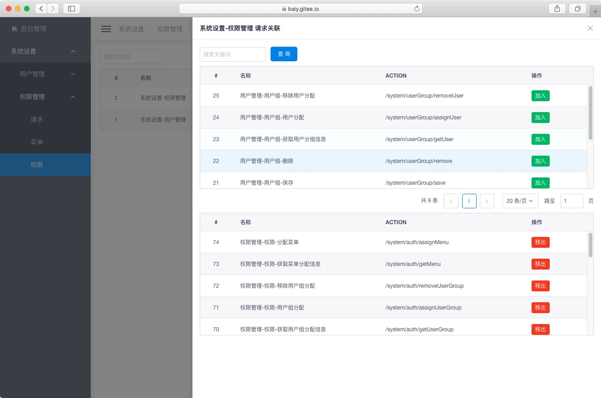 |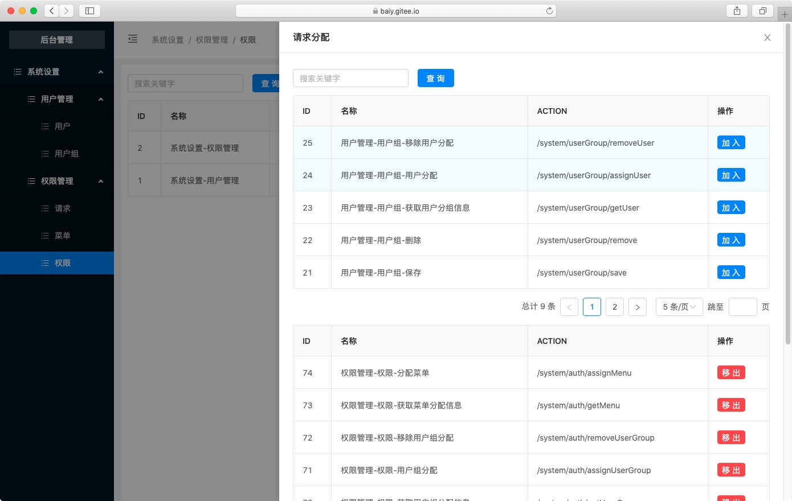 |

## 系统结构图 {docsify-ignore}

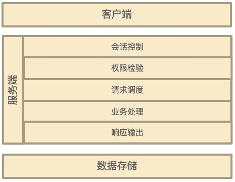

