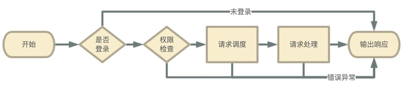
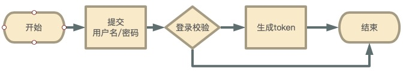
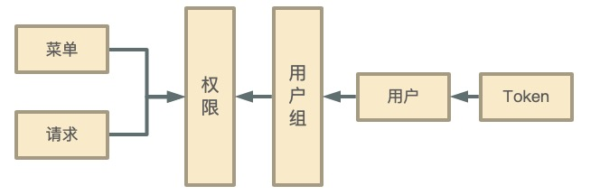

## 执行流程

这是一个典型的客户端发起的API请求执行流程,其中登录检查和权限校验模块会根据服务端配置来决定是否进行

例如: [用户登录接口](api/init?id=系统登录) 是不需要进行登录检查和权限校验的

> 具体接口是否需要进行权限校验和登录检查请查阅 [前后端交互接口协议](api/README)

## 会话保持

会话保持就是维护用户登录状态, 我们使用`url`固定传递`token`参数的方式进行保持. 

用户登录后台生成的随机`token`并返回给客户端,服务端使用数据库存储并关联到用户, 后面客户端访问需要授权的接口均需携带`token`, 供服务端鉴权使用

常见应用一般使用`session`/`cookie`来进行会话保持,Cadmin并没有使用他们来做会话保持.原因如下:

`session`: 在服务端分布式部署情况下需要进行`session`同步与共享, 而且容易造成对外部系统的依赖. 例如:`PHP`需要使用`session_start()`函数启用`session`

`cookie`: cookie是浏览器的特有机制, 非浏览器客户端使用较为不便

## 权限校验

根据上图所示的数据关系, 分别根据前端传入的`token`和`action`获取对应的用户信息和请求信息,进而进行权限判断, 大致过程如下:

1. 获取用户拥有权限列表: `token`=>`用户`=>`用户组`=>`权限`
2. 获取请求所属权限列表: `action`=>`请求`=>`权限`
3. 判断用户拥有权限与请求所属权限是否有交集

[什么是token和action](api/README)

## 请求调度

当请求通过登录校验和权限校验以后, 通常情况会进入业务处理阶段. 为适应更多业务处理场景, 系统增加了请求调度阶段, 大致过程如下:

1. 根据 `action` 获取请求配置信息
2. 根据请求配置类型, 使用 `调度器配置信息(call字段)`/`请求信息`/`当前用户信息` 初始化对应的请求调度器
3. 调度器根据调度器配置信息发起业务处理,并根据实际请求传入`请求信息`/`当前用户信息`

> 请求配置信息对应表 [admin_request](server/db)
> `call` 一般是调度器的分发路由配置信息, 具体配置格式由调度器来定义